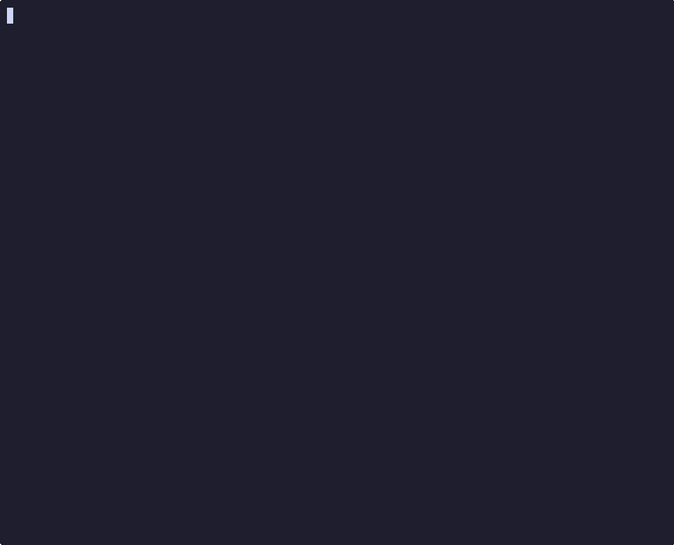

# Roxy


**Stop juggling localhost ports.** Get real `.roxy` domains with trusted
HTTPS for every local project.

**One binary. Zero config files. Zero dependencies.**

- ✓ Test OAuth/webhooks locally with real HTTPS
- ✓ See all traffic in real-time
- ✓ Share work across devices
- ✓ No nginx. No dnsmasq. No Docker. No YAML.

> ⚠️ **Early Development**: Roxy is ready for daily use on macOS, but
> things may shift around.
> [Report issues here](https://github.com/rbas/roxy/issues).

---

## Why Roxy?

| Without Roxy | With Roxy |
| ------------ | --------- |
| `http://localhost:3000` + certificate warnings | `https://myapp.roxy` - trusted ✓ |
| Remember 5 different ports for 5 services | One domain, path-based routing |
| Can't test webhooks/OAuth locally | Works with Stripe, OAuth, callbacks |
| Edit nginx configs, restart services | `roxy register myapp.roxy` |
| Manual setup for each subdomain | `--wildcard` and every subdomain just works |
| No visibility into traffic | Full request/WebSocket logging |

## See It In Action



## Try It in 60 Seconds

```bash
# 1. Install via Homebrew
brew tap rbas/roxy
brew install roxy

# 2. One-time setup (creates Root CA, configures DNS)
sudo roxy install

# 3. Register your first project
roxy register myapp.roxy --route "/=3000" --route "/api=3001"

# 4. Start the proxy
sudo roxy start

# 5. Open in browser
open https://myapp.roxy
```

> **Note:** After first install, restart your browser for the certificates to be recognized.

**That's it.** Trusted HTTPS, no warnings, no config files. Just works.

**Find Roxy useful?** ⭐ [Star the repo](https://github.com/rbas/roxy)
to help others discover it!

## Perfect For

- 🚀 **Full-stack developers** — Run frontend + backend + database with
  memorable domains
- 📱 **Mobile app developers** — Test APIs that require HTTPS without
  tunnels
- 🔗 **OAuth/webhook development** — Real HTTPS callbacks work locally
  (Stripe, GitHub, etc.)
- 👥 **Teams** — Share work across devices on the same network
- 🔧 **Microservices developers** — Stop memorizing which service is on which port
- 🏢 **Multi-tenant SaaS developers** — Wildcard subdomains
  (`*.myapp.roxy`) for testing tenant routing locally
- 🎨 **Anyone tired of `localhost:3000`** — Get real domains
  like `myapp.roxy` instead

### Multiple Projects, Zero Conflicts

```bash
roxy register frontend.roxy --route "/=3000"
roxy register backend.roxy --route "/=8080" --route "/api=8081"
roxy register docs.roxy --route "/=/var/www/docs"

# Wildcard: one registration covers all subdomains
roxy register myapp.roxy --wildcard --route "/=3000"
# → myapp.roxy, api.myapp.roxy, admin.myapp.roxy...
```

All domains work simultaneously. No port conflicts.
No config files to manage.

## Features

**Core Features:**

- ✓ **Custom `.roxy` domains** — `myapp.roxy` instead of `localhost:3000`
- ✓ **Trusted HTTPS** — Auto-generated certificates your browser
  actually trusts (no warnings!)
- ✓ **Path-based routing** — Route `/` to port 3000, `/api` to port
  3001, `/static` to a directory
- ✓ **Built-in DNS server** — No dnsmasq, no external DNS tools needed
- ✓ **Wildcard subdomains** — Register `*.myapp.roxy` and every
  subdomain just works, with trusted HTTPS
- ✓ **Single binary** — No nginx, no containers, no runtime dependencies

**Developer Experience:**

- ✓ **Real-time traffic logs** — See every HTTP request and WebSocket
  connection with `roxy logs -f`
- ✓ **WebSocket support** — Full proxying and connection lifecycle tracking
- ✓ **Static file serving** — Serve directories with automatic `index.html`
  support and file browser
- ✓ **LAN access** — Access your projects from phone/tablet on the same network
- ✓ **Any tech stack** — Works with Next.js, Rails, Django, Express,
  Go, Rust, PHP... anything on any port

## Real-World Examples

### Testing Stripe Webhooks Locally

Stripe webhooks require HTTPS. With Roxy, it's trivial:

```bash
# Register your e-commerce app
roxy register shopify-clone.roxy \
  --route "/=3000" \
  --route "/api=3001"

# Point Stripe webhooks to: https://shopify-clone.roxy/api/webhooks
# No ngrok. No tunnels. No port forwarding. Just works.
```

### Full-Stack Next.js + Express App

```bash
# Frontend on port 3000, API on port 3001, admin dashboard on port 8080
roxy register myapp.roxy \
  --route "/=3000" \
  --route "/api=3001" \
  --route "/admin=8080"

# Access:
# https://myapp.roxy          → Next.js frontend
# https://myapp.roxy/api      → Express API
# https://myapp.roxy/admin    → Admin dashboard
```

### Multi-Tenant SaaS with Wildcard Subdomains

Your app uses subdomains for tenants? One command:

```bash
# Register a wildcard — covers myapp.roxy AND *.myapp.roxy
roxy register myapp.roxy --wildcard \
  --route "/=3000" \
  --route "/api=3001"

# All of these work instantly, trusted HTTPS included:
# https://myapp.roxy            → main app
# https://acme.myapp.roxy       → tenant "acme"
# https://globex.myapp.roxy     → tenant "globex"
# No extra registration needed. Just add a subdomain and go.
```

### Mobile App Development

```bash
# Start your API server on port 3000
roxy register api.roxy --route "/=3000"

# Now your phone on the same WiFi can access:
# https://api.roxy
# (Add your Mac's IP to your phone's /etc/hosts or use LAN IP mode)
```

Works with **any stack**: Next.js, Rails, Django, Express, Flask, Go,
Rust, PHP... anything that speaks HTTP.

## Full Traffic Visibility

Unlike nginx or Valet, Roxy shows you **everything** flowing through it in real-time:

```bash
# Follow traffic live (like tail -f)
roxy logs -f
```

**Example output:**

```text
INFO Request completed method=GET host=myapp.roxy path=/ status=200 duration_ms=45
INFO Request completed method=POST host=myapp.roxy path=/api/users status=201 duration_ms=123
INFO WebSocket connection established target=127.0.0.1:3000
INFO WebSocket message sent bytes=156 target=127.0.0.1:3000
INFO WebSocket message received bytes=89 target=127.0.0.1:3000
INFO WebSocket connection closed target=127.0.0.1:3000 duration_ms=45230
INFO DNS query domain=myapp.roxy qtype=A response=127.0.0.1
```

**Need debugging details?** Turn on verbose mode:

```bash
sudo roxy start --verbose
```

```text
DEBUG Routing request method=GET host=myapp.roxy path=/api/users matched_route=/api
DEBUG Proxying HTTP request target=127.0.0.1:3001 headers=5
DEBUG Proxy response target=127.0.0.1:3001 status=200 body_size=1024
DEBUG WebSocket upgrade successful target=127.0.0.1:3000
```

**Perfect for:**

- Debugging API calls between frontend and backend
- Tracking WebSocket connection issues
- Understanding which service handled which request
- Monitoring DNS resolution for `.roxy` domains

## Usage

```bash
# Register a domain with routes
roxy register <domain> --route "PATH=TARGET" [--route "PATH=TARGET" ...]

# Register with wildcard subdomains (*.myapp.roxy)
roxy register <domain> --wildcard --route "PATH=TARGET"

# Targets can be:
#   Port:        --route "/=3000"              → proxies to 127.0.0.1:3000
#   Host:Port:   --route "/=192.168.1.50:3000" → proxies to a specific host
#   Directory:   --route "/static=/var/www"     → serves static files

# Manage routes on existing domains
roxy route add myapp.roxy /webhooks 9000
roxy route remove myapp.roxy /webhooks
roxy route list myapp.roxy

# Unregister a domain
roxy unregister myapp.roxy

# List all registered domains
roxy list

# Daemon control
sudo roxy start              # Start in background
sudo roxy start --foreground # Start in foreground
sudo roxy stop
sudo roxy restart
roxy status

# View logs
roxy logs
roxy logs -f          # Follow (like tail -f)
roxy logs -n 100      # Last 100 lines
```

## Auto-Start on Boot

If you installed Roxy via Homebrew, you can use `brew services` to start Roxy
automatically at boot:

```bash
# Start roxy now and auto-start at boot
sudo brew services start roxy
```

Roxy stores its configuration in `/etc/roxy/config.toml`, so it works
automatically when started by launchd at boot — no extra environment
variables needed.

To stop auto-start:

```bash
sudo brew services stop roxy
```

## How It Works

**Three steps, then forget about it:**

1. **`roxy install`**
   - Creates a trusted Root Certificate Authority (CA)
   - Adds it to your system keychain (so browsers trust it)
   - Configures DNS to resolve `.roxy` domains to `127.0.0.1`
   - **⚠️ Restart your browser** after first install for certificates to be recognized

2. **`roxy register <domain>`**
   - Generates an SSL certificate signed by your Root CA
   - Saves your routing configuration (which paths go to which ports/directories)

3. **`roxy start`**
   - Starts HTTP (`:80`) and HTTPS (`:443`) servers
   - Starts the DNS server (`:53`) for `.roxy` domains
   - Routes incoming requests to your local services based on path

**Your browser trusts the certificates** (no warnings) because they're
signed by your Root CA. WebSockets work transparently. DNS queries for
`.roxy` domains resolve instantly.

**Clean and contained:**

- Config, certs, and CA: `/etc/roxy/`
- Logs: `/var/log/roxy/`
- PID file: `/var/run/roxy.pid`
- DNS configuration: `/etc/resolver/roxy` (macOS)
- Run `roxy uninstall` to remove everything cleanly

For configuration details, logging options, and file locations see the [full documentation](docs/README.md).

## How Is This Different?

| Feature | Roxy | nginx/Traefik | Laravel Valet | ngrok | /etc/hosts |
| ------- | ---- | ------------- | ------------- | ----- | ---------- |
| Zero config files | ✓ | ✗ | ✗ | ✓ | ~ |
| Trusted HTTPS | ✓ | Manual setup | ✓ | ✓ | ✗ |
| Path-based routing | ✓ | Manual setup | ✗ | Limited | ✗ |
| Built-in traffic logs | ✓ | Manual setup | ✗ | ✓ | ✗ |
| Stays local | ✓ | ✓ | ✓ | ✗ | ✓ |
| Single binary | ✓ | ✗ | ✗ | ✓ | N/A |
| Any tech stack | ✓ | ✓ | PHP-focused | ✓ | ✓ |
| WebSocket support | ✓ | ✓ | ~ | ✓ | ~ |
| Wildcard subdomains | ✓ | Manual setup | ✗ | ✗ | ✗ |
| Built-in DNS server | ✓ | ✗ | Uses dnsmasq | N/A | ✗ |

**TL;DR:** Roxy gives you the power of nginx with the simplicity of
ngrok, but everything stays on your machine. One command to register a
domain, no config files to edit.

## Installation & Requirements

### Requirements

- **macOS** (Monterey or later recommended)
  - Linux support is planned! [Track progress here](https://github.com/rbas/roxy/issues)
- **Rust** toolchain (for building from source)
- **sudo** access (needed for ports 80/443 and DNS configuration)

### Install via Homebrew (Recommended)

```bash
brew tap rbas/roxy
brew install roxy
```

### Pre-built Binaries

Download the latest binary for your platform from the [Releases page](https://github.com/rbas/roxy/releases):

**macOS (Apple Silicon):**

```bash
# Download the latest release
curl -LO https://github.com/rbas/roxy/releases/latest/download/roxy-macos-arm64.tar.gz
tar -xzf roxy-macos-arm64.tar.gz

# Install
sudo mv roxy /usr/local/bin/

# Verify installation
roxy --version
```

### Install from Source

```bash
# Clone the repository
git clone https://github.com/rbas/roxy.git
cd roxy

# Build and install
cargo install --path .

# Verify installation
roxy --version
```

## What's Next

Roxy is ready for daily development use on macOS. Recent additions and future plans:

- [x] **Pre-built binaries** — download and run without building from source
  (macOS ARM64)
- [x] **Homebrew support** — `brew tap rbas/roxy && brew install roxy`
- [x] **Auto-start on boot** — launch daemon via launchd with `brew services`
- [x] **File browser** — automatic directory listing
  for static file routes
- [x] **Wildcard subdomains** — `*.myapp.roxy` patterns
  with automatic certificate generation
- [ ] **Linux support** — extend to Linux development
  environments
- [ ] **Docker network DNS** — resolve `.roxy` domains
  inside containers without `extra_hosts`

Have a feature idea?
[Open an issue](https://github.com/rbas/roxy/issues) and let's discuss!

---

## Documentation & Support

- 📖 **Full documentation**: [docs/README.md](docs/README.md)
- 🐛 **Having issues?**: Check the [troubleshooting guide](docs/README.md#troubleshooting)
- 💬 **Questions or feedback?**: [Open an issue](https://github.com/rbas/roxy/issues)

## License

[MIT](LICENSE.md) — Martin Voldrich
